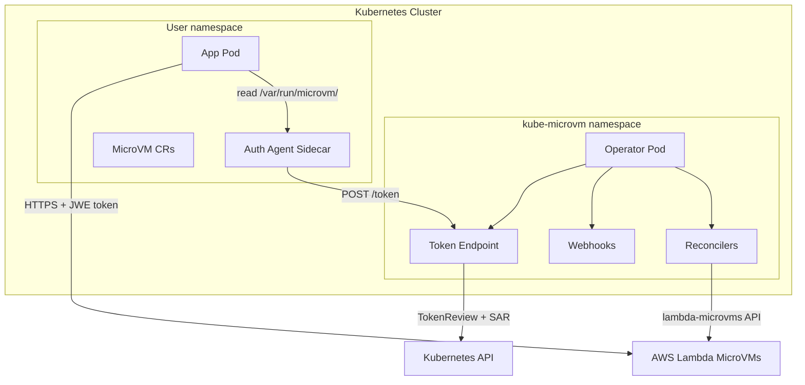
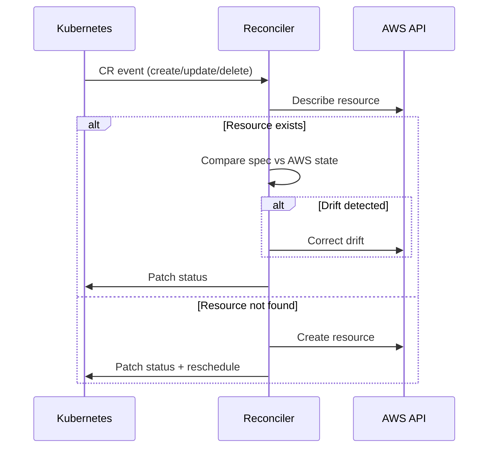
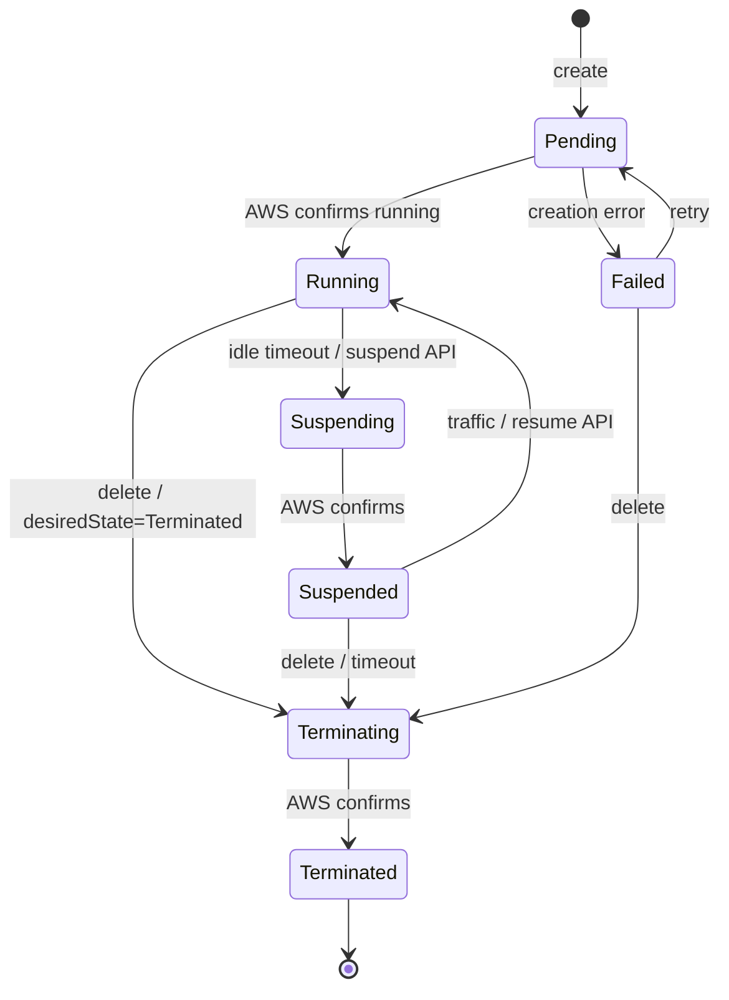
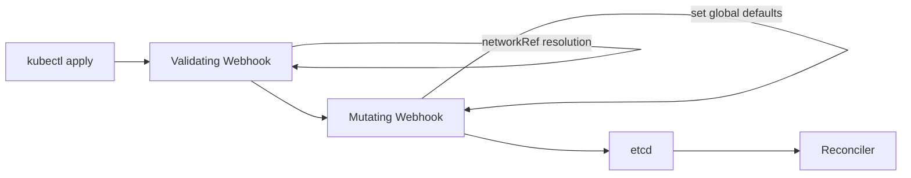

# Architecture

## System Overview

## Reconciliation Pattern

Each reconciler follows the ACK (AWS Controllers for Kubernetes) pattern:

## State Machine (MicroVM lifecycle)

## Admission Control Flow

## Design Principles

- **Namespace isolation**: Operator watches only namespaces labelled `lambda.aws.amazon.com/manage-microvms=true`
- **Finalizer-based cleanup**: All CRs with AWS resources have finalizers to prevent orphaning
- **Drift detection**: Reconcilers poll AWS state and correct divergence
- **Token-based auth**: Two-step Kubernetes TokenReview + SubjectAccessReview before proxying to AWS
- **Immutable image sizing**: Memory is set at image creation (AWS constraint)
- **Class inheritance**: MicroVMClass provides opt-in defaults merged at admission time
