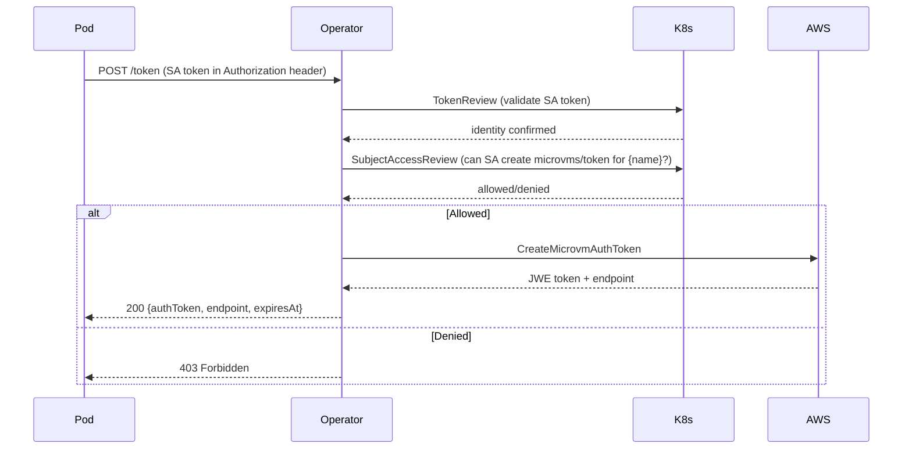

# Components

## Reconcilers (operator-controller)

| Reconciler | Resource | Key Responsibilities |
|-----------|----------|---------------------|
| `MicroVMReconciler` | MicroVM | Create/terminate VMs, drift detection, state machine transitions, image/network ref resolution, tag sync |
| `MicroVMImageReconciler` | MicroVMImage | Create/update images, poll build status, auto-activate versions, memory sizing |
| `MicroVMReplicaSetReconciler` | MicroVMReplicaSet | Scale up/down, health eviction, cascade delete |
| `MicroVMNetworkReconciler` | MicroVMNetwork | Create/delete VPC connectors, poll connector state |
| `MicroVMPoolReconciler` | MicroVMPool | Alternative pool management (not in user guides yet) |

## AWS SDK Clients (operator-controller)

| Client | AWS Service | Operations |
|--------|------------|-----------|
| `DefaultMicroVMClient` | lambda-microvms | run, suspend, resume, terminate, get, list, createAuthToken, createShellAuthToken |
| `MicroVMImageClient` | lambda-microvms | createImage, updateImage, getImage, deleteImage, listVersions, activateVersion |
| `MicroVMNetworkClient` | lambda-core | createConnector, getConnector, updateConnector, deleteConnector |

## Webhooks (operator-webhook)

| Webhook | Type | Responsibilities |
|---------|------|-----------------|
| `MicroVMValidatingWebhook` | Validating | Namespace label check, className exists, memorySizeMiB valid values + immutability, networkRef resolution, namespace quota |
| `MicroVMMutatingWebhook` | Mutating | Merge MicroVMClass defaults, apply global defaults (maximumDurationSeconds, autoResumeEnabled) |
| `PodMutatingWebhook` | Mutating | Inject `microvm-auth-agent` sidecar when pod has `lambda.microvm.auth` annotation |

## Token Endpoint (operator-controller)

`MicroVMTokenResource` — REST endpoint at `/apis/lambda.aws.amazon.com/v1alpha1/namespaces/{ns}/microvms/{name}/token`

## Auth Agent Sidecar (operator-auth-agent)

`TokenRefreshAgent` — Quarkus app injected as sidecar container. Fetches token from operator endpoint using pod's SA token, writes to shared emptyDir volume at `/var/run/microvm/`.

Files written: `auth-token`, `endpoint`, `expires-at`, `.ready`

## CLI (operator-cli)

`microvm` binary (GraalVM native). Also works as `kubectl microvm` via symlink.

Key command groups: `list`, `describe`, `create`, `delete`, `pause`, `resume`, `token`, `exec`, `image`, `rs`, `network`

## Health & Metrics (operator-controller)

- `AwsConnectivityHealthCheck` — readiness probe (AWS API reachable)
- `AwsConnectivityStartup` — startup probe (initial AWS connectivity)
- `OperatorMetrics` — Micrometer metrics for reconciliation, AWS API calls, state transitions
