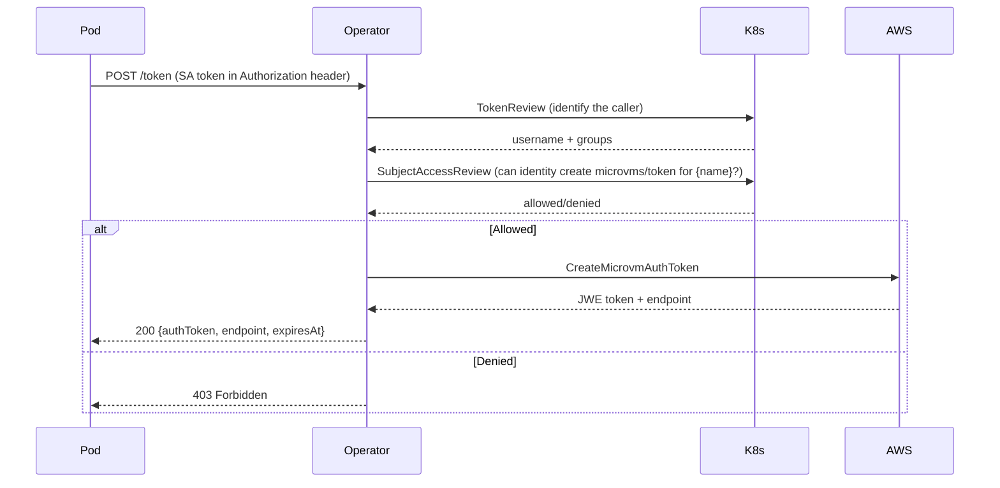

# Components

## Reconcilers (operator-controller)

| Reconciler | Resource | Key Responsibilities |
|-----------|----------|---------------------|
| `MicroVMReconciler` | MicroVM | Create/terminate VMs, drift detection, state machine transitions, image/network ref resolution, tag sync |
| `MicroVMImageReconciler` | MicroVMImage | Create/update images, poll build status, auto-activate versions, memory sizing, version pruning |
| `MicroVMReplicaSetReconciler` | MicroVMReplicaSet | Scale up/down, health eviction, cascade suspend/resume, rolling update (RollingUpdate + Recreate strategies), template hash tracking |
| `MicroVMNetworkReconciler` | MicroVMNetwork | Create/delete VPC connectors, poll connector state, adoption of existing connectors |
| `MicroVMPoolReconciler` | MicroVMPool | Internal pool management (not yet user-facing) |

## AWS SDK Clients (operator-controller)

| Client | AWS Service | Operations |
|--------|------------|-----------|
| `DefaultMicroVMClient` | lambda-microvms | run, suspend, resume, terminate, get, list, createAuthToken, createShellAuthToken, tag/untag |
| `MicroVMImageClient` | lambda-microvms | createImage, updateImage, getImage, deleteImage, listVersions, activateVersion, deleteVersion, listManagedBaseImages |
| `MicroVMNetworkClient` | lambda-core | createConnector, getConnector, updateConnector, deleteConnector, listConnectors |

## Webhooks (operator-webhook)

| Webhook | Type | Responsibilities |
|---------|------|-----------------|
| `MicroVMValidatingWebhook` | Validating | Namespace label check, className exists, memorySizeMiB valid values + immutability, networkRef resolution, importMicroVmId immutability, namespace quota |
| `MicroVMMutatingWebhook` | Mutating | Merge MicroVMClass defaults, apply global defaults (maximumDurationSeconds, autoResumeEnabled) |
| `PodMutatingWebhook` | Mutating | Inject `microvm-auth-agent` sidecar when pod has `lambda.microvm.auth` annotation; registered in Helm MutatingWebhookConfiguration with `failurePolicy: Ignore` |

## Token Endpoint (operator-controller)

`MicroVMTokenResource` — REST endpoint at `/apis/lambda.aws.amazon.com/v1alpha1/namespaces/{ns}/microvms/{name}/token`

Security: **two-step validation** — TokenReview first (exchange Bearer token for identity), then SubjectAccessReview (check RBAC for that identity). The operator SA requires `tokenreviews: create` and `subjectaccessreviews: create` ClusterRole permissions.

## Auth Agent Sidecar (operator-auth-agent)

`TokenRefreshAgent` — Quarkus app injected as sidecar container. Fetches token from operator endpoint using pod's SA token, writes to shared `emptyDir medium: Memory` volume at `/var/run/microvm/`.

Files written:
- `auth-token` — JWE token for `X-aws-proxy-auth` header
- `endpoint` — VM's HTTPS hostname
- `expires-at` — token expiry timestamp
- `.ready` — sentinel file written after first successful token fetch; init containers / startup probes can wait on this

Activated by pod annotation `lambda.microvm.auth: <vm-name>`. Namespace must be labelled `lambda.microvm.auth/inject=enabled` for sidecar injection to fire.

## CLI (operator-cli)

`microvm` binary (GraalVM native). Also works as `kubectl microvm` via symlink.

Key command groups: `list`, `describe`, `create`, `delete`, `pause`, `resume`, `token`, `exec`, `image`, `rs`, `network`

**Token/exec fallback logic**: `token` and `exec` commands try the operator sub-resource endpoint first (works in-cluster without AWS credentials). Falls back to direct AWS SDK call if operator returns 404/501. `--direct` flag skips operator and always calls AWS directly.

## Quota Guard (operator-controller)

`QuotaGuard` — wraps all AWS API calls with rate limiting and concurrency control. Uses token bucket algorithm for per-second burst limits. `QuotaDiscovery` auto-discovers account quotas at startup from the Lambda MicroVMs service.

## SPI (operator-spi + operator-controller/spi)

Extension interfaces for PRO overrides. Community defaults live in `operator-controller/.../spi/Default*.java`.

| Interface | Community Default | Purpose |
|-----------|------------------|---------|
| `QuotaPolicy` | `DefaultQuotaPolicy` | Effective rate/image build limits |
| `TenantResolver` | `DefaultTenantResolver` | Namespace-to-tenant mapping |
| `TokenPolicy` | `DefaultTokenPolicy` | Token expiry clamping, pre/post hooks |
| `OperatorExtension` | `DefaultOperatorExtension` | Startup/shutdown hooks |

## Health & Metrics (operator-controller)

- `AwsConnectivityHealthCheck` — readiness probe (AWS API reachable + informer caches synced)
- `AwsConnectivityStartup` — startup probe (initial AWS connectivity confirmed)
- `OperatorMetrics` — Micrometer metrics: reconciliation counts, AWS API calls, state transitions, pool reconciliation
