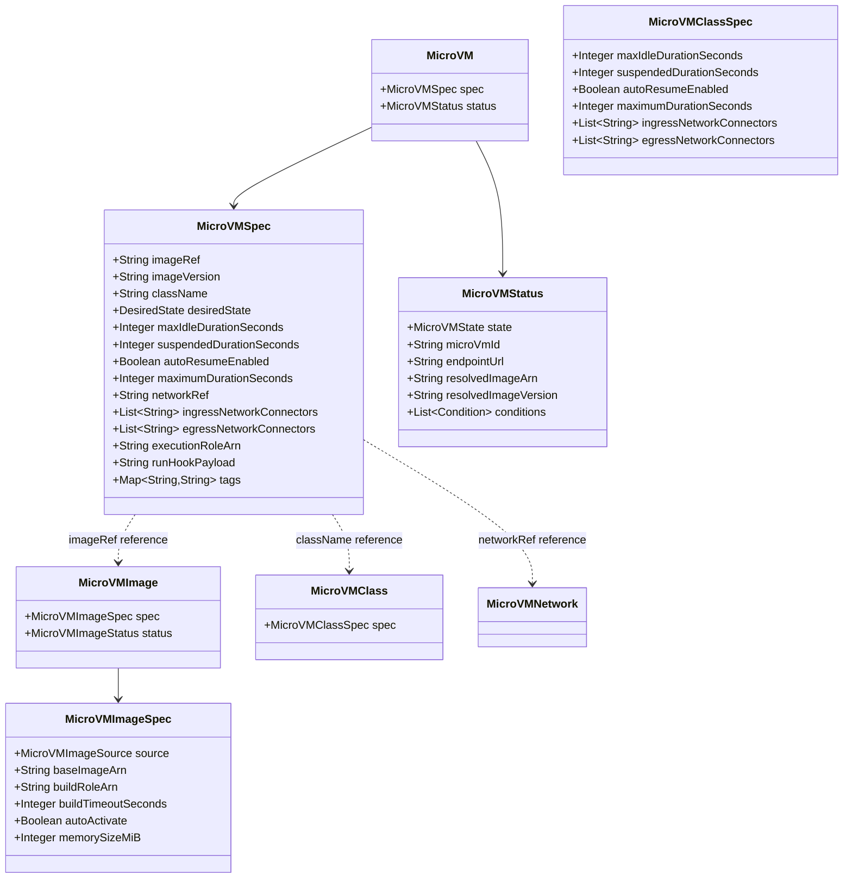

# Data Models

## Core CRD Models (operator-core)

## Enums

| Enum | Values |
|------|--------|
| `DesiredState` | Running, Suspended, Terminated |
| `MicroVMState` | Pending, Running, Suspending, Suspended, Terminating, Terminated, Failed |

## State Machine Transitions

| From | Valid Targets |
|------|-------------|
| Pending | Running, Failed |
| Running | Suspending, Terminating |
| Suspending | Suspended |
| Suspended | Running, Terminating |
| Failed | Pending, Terminating |
| Terminating | Terminated |
| Terminated | (none) |

## AWS SDK Models (operator-aws-client)

Generated from service model. Key types:
- `RunMicrovmRequest/Response` — launch a MicroVM
- `CreateMicrovmImageRequest/Response` — build an image (includes `Resources` with `minimumMemoryInMiB`)
- `CreateMicrovmAuthTokenRequest/Response` — generate JWE auth token
- `NetworkConnector` — VPC egress connector state
- `Resources` — compute sizing (`minimumMemoryInMiB`)

## additionalProperties

`MicroVMSpec` includes `@JsonAnySetter`/`@JsonAnyGetter` for forward-compatibility with new AWS fields. Unknown fields from the API are preserved in a `Map<String, Object>` without breaking deserialization.
