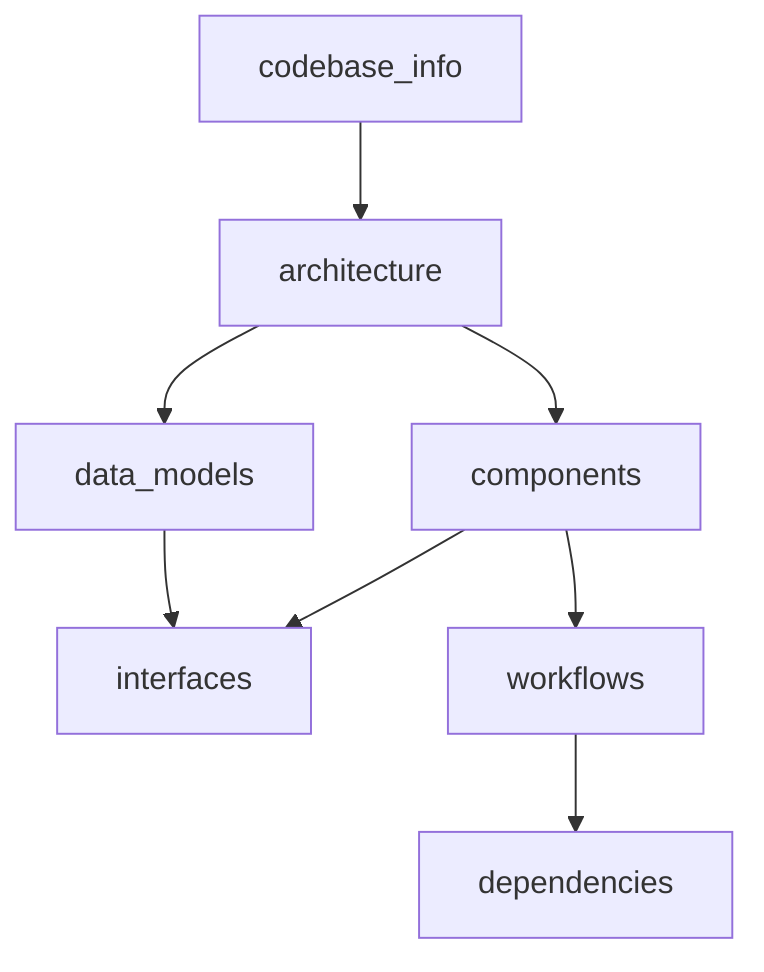

# Knowledge Base Index

> **For AI Assistants**: This file is your primary entry point. Read this first to understand
> what documentation exists and where to find specific information. Each file below contains
> detailed content — consult the relevant file when you need depth on a topic.

## How to Use This Documentation

1. **Start here** — scan the summaries below to identify which file has the answer
2. **Consult specific files** — read the relevant `.md` file for detailed information
3. **Cross-reference** — files link to each other; follow references for full context
4. **Steering files** — `.kiro/steering/` contains operational rules the agent MUST follow

## File Index

| File | Purpose | Consult When... |
|------|---------|----------------|
| [codebase_info.md](codebase_info.md) | Project identity, tech stack, module map | You need to understand what this project is, what language/framework it uses, or how modules relate |
| [architecture.md](architecture.md) | System design, reconciliation pattern, state machine, admission flow | You need to understand how the system works end-to-end, component interactions, or design decisions |
| [components.md](components.md) | Detailed breakdown of reconcilers, clients, webhooks, CLI | You need to find which class is responsible for a feature, or understand a specific component |
| [interfaces.md](interfaces.md) | CRD specs, REST API, AWS API operations, CLI commands | You need field names, API shapes, endpoint paths, or CLI syntax |
| [data_models.md](data_models.md) | CRD model classes, enums, state transitions, SDK types | You need to understand data structures, valid states, or serialization |
| [workflows.md](workflows.md) | Development workflow, image build, VM run, token flow, deployment | You need step-by-step processes or sequence diagrams |
| [dependencies.md](dependencies.md) | Tech stack versions, AWS services, base images, infrastructure | You need dependency info, version numbers, or external service details |

## Key Relationships

## Quick Reference

- **"How do I add a new CRD field?"** → data_models.md (model structure) + components.md (reconciler) + interfaces.md (CRD schema)
- **"How does token auth work?"** → architecture.md (overview) + components.md (MicroVMTokenResource) + workflows.md (token flow)
- **"What AWS APIs do we call?"** → interfaces.md (AWS APIs Used) + components.md (SDK clients)
- **"How do I deploy to EKS?"** → workflows.md (EKS Deployment) + `.kiro/steering/eks-deployment.md`
- **"What's the test strategy?"** → codebase_info.md (test tools) + workflows.md (dev workflow) + `uat/` (Robot Framework)
- **"How does the mutating webhook work?"** → components.md (Webhooks) + architecture.md (Admission Control Flow)

## Steering Files (Operational Rules)

These files in `.kiro/steering/` contain MUST-follow rules for development:

| File | Key Rules |
|------|-----------|
| `build-test-requirements.md` | Run `./mvnw install -DskipTests && ./mvnw -pl operator-tests verify` before pushing code changes |
| `eks-deployment.md` | Always delete webhooks before CRs when operator is down; never `helm upgrade` during dev |
| `feature-branch-workflow.md` | Feature branch → develop → test → deploy → E2E → merge flow |
| `external-dependencies.md` | Use AWS endpoints (checkip.amazonaws.com), public.ecr.aws images |
| `release-versioning.md` | Tag format: `v<M>.<m>.
-rc<N>`, GA drops suffix |

## Contributing & CLA

- `CONTRIBUTING.md` — development setup, coding standards, contribution workflow
- `CLA.md` — Contributor License Agreement (ELv2, must sign before PR merge)
- `signatures/cla.json` — CLA signatures (auto-updated by bot on `main`)
- Branch protection on `main`: requires `CLA Assistant` status check (strict)
