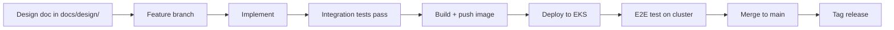
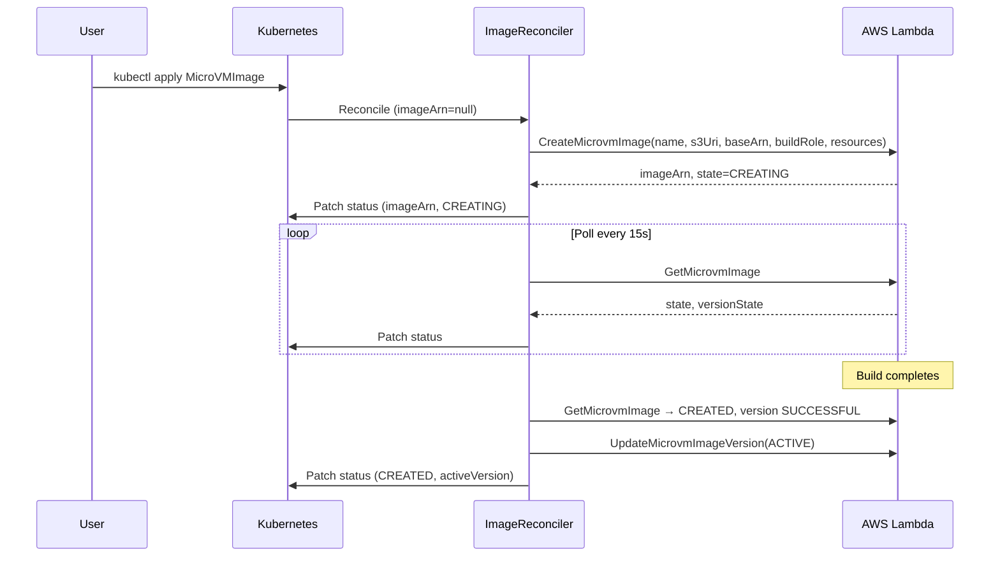
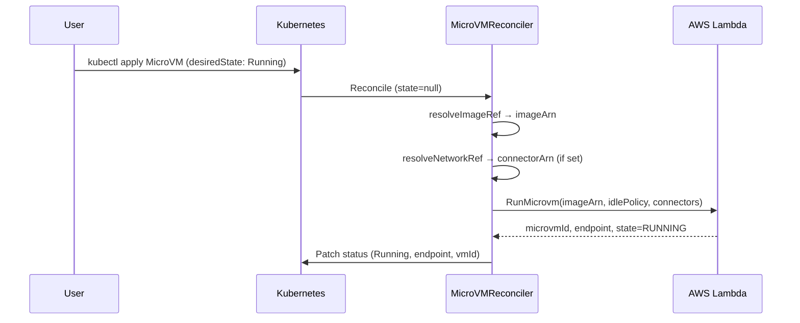
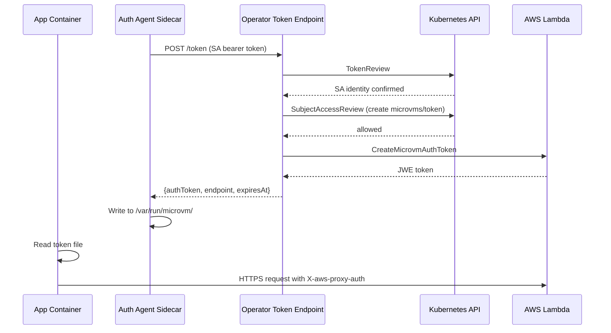
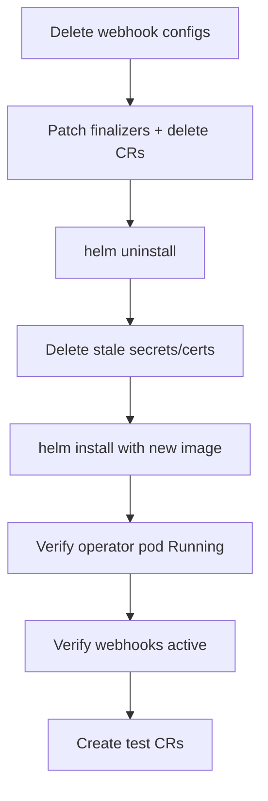
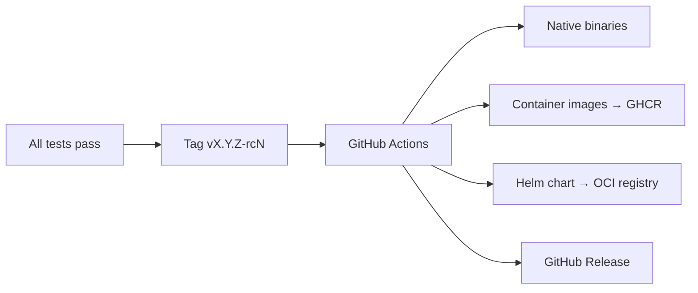

# Workflows

## Feature Development Workflow

Key rules:
- Tests required before push (code changes only)
- `helm uninstall` + `helm install` (never `upgrade` during dev)
- Delete webhooks before CRs when operator is down
- Patch finalizers before deleting CRs without operator

## Image Build Workflow

## MicroVM Run Workflow

## Token Flow (in-cluster)

## EKS Deployment Workflow

## Release Workflow

Tag notation: `v<major>.<minor>.<patch>-rc<N>` → GA drops `-rcN` suffix.
